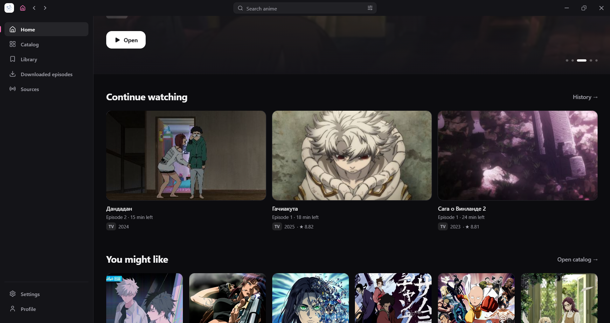
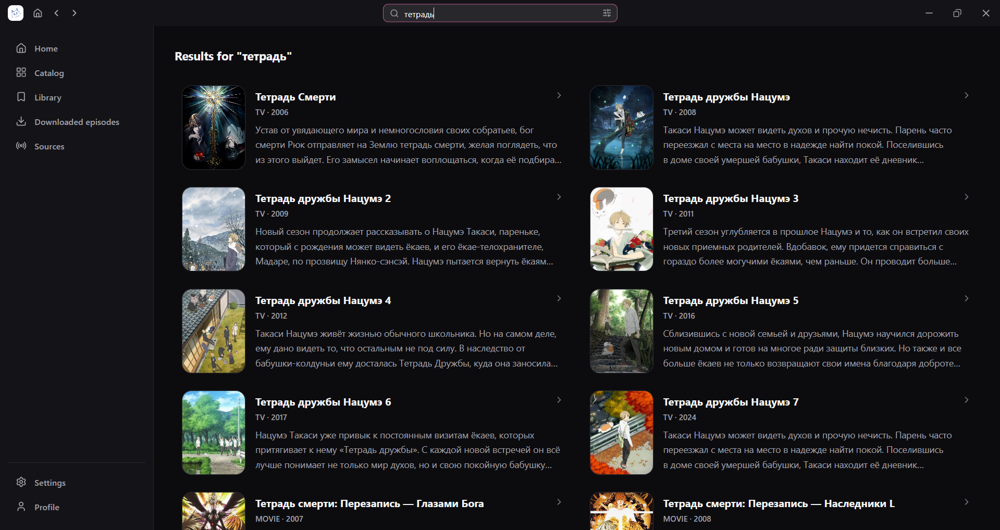
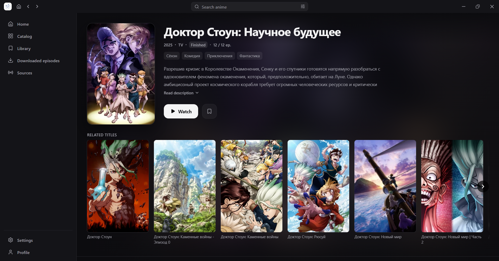
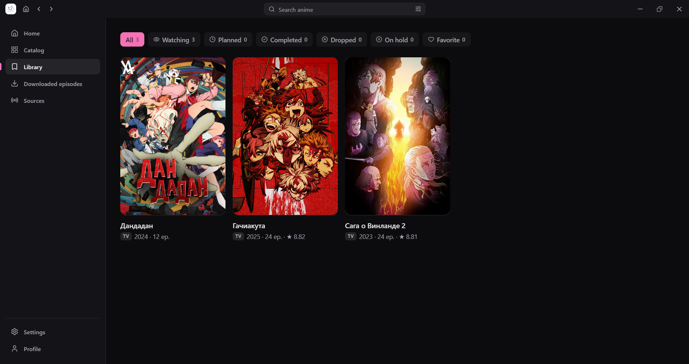

<div align="center">

  

  # hibiki desktop

  [Русский](README_RU.md)

  **hibiki desktop is a Windows app with a personal anime catalogue, local library, player, and on-device watch progress. Content providers are selected through external source repositories; the app does not host or distribute content.**

  There is also an [Android app](https://github.com/akkirrai1337/hibiki), which uses the same source format.

  
  
  
  
  [](LICENSE)

</div>

### 📚 Features

* Switchable anime sources, with source-aware catalog, search, filters, and sorting
* External source repositories, installed and updated from an in-app extension marketplace ([hibiki-sources](https://github.com/akkirrai1337/hibiki-sources))
* Detailed title pages with descriptions, genres, ratings, related, franchise, and similar titles
* Episode and voice-over selection, with the player and dub remembered per title
* Built-in player with HLS, DASH, and MP4 support, plus an embedded fallback for sources that only expose one
* Playback controls: quality, player engine, dub, speed, autoplay, and opening/ending skip
* Keyboard shortcuts, hold-to-fast-forward, and remembered volume
* Watch progress, continue watching with captured frames, and watch history
* Local profile with viewing statistics, watch streaks, XP, and achievements
* Local library: watching, planned, completed, dropped, on hold, and favourites
* Offline episode downloads and playback
* Light and dark themes, a custom accent color, and Discord-style background gradients
* Russian, English, and Ukrainian app languages
* Optional Discord Rich Presence
* Local backup and restore of library, history, sources, and settings

<div align="center">

### 🖼️ App screenshots

<table>
  <tr>
    <td></td>
    <td></td>
  </tr>
  <tr>
    <td></td>
    <td></td>
  </tr>
</table>

</div>

### 🛠️ Building from source

Requires Node.js 20+ and npm.

```bash
npm install
npm run dev
```

`npm run build` produces an NSIS installer. Windows is the only platform this app is built and tested on; nothing here is cross-compiled, since `better-sqlite3` is a native module compiled for the host it's built on.

### 💬 Contact

For questions, suggestions, or bug reports, you can contact me on Discord: `akkirrai`

### 📄 License

hibiki desktop is licensed under the [GNU General Public License v3.0](LICENSE).

### ⚖️ DMCA Disclaimer

The developer of this application does not have any affiliation with the content available in the app and does not store or distribute any content. This application should be considered a web browser, and all content that can be found using this application is freely available on the Internet. All DMCA takedown requests should be sent to the owners of the website where the content is hosted.
