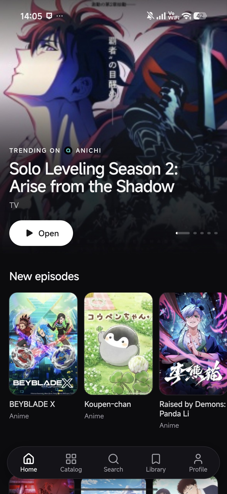
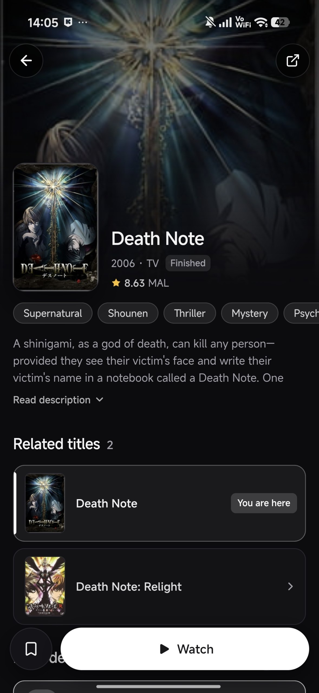
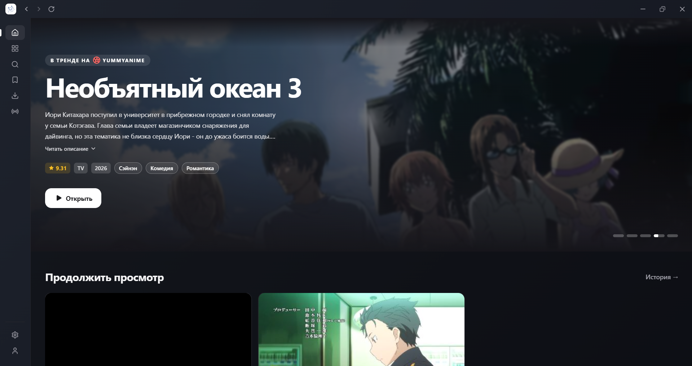
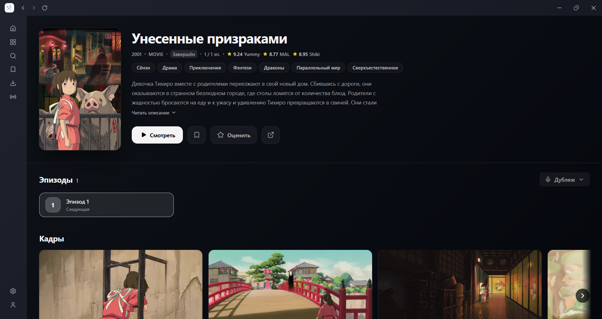

  

  # hibiki

  [Русский](README_RU.md)

  **hibiki is an anime client for browsing titles, managing a personal library, and watching episodes with saved progress. Sources are connected through external repositories; the app does not host or distribute content.**

  

### 📚 Features

* Browse anime from your chosen sources, with search, filters, and sorting
* Connect external source repositories and manage extensions ([hibiki-sources](https://github.com/akkirrai1337/hibiki-sources))
* Explore title details, descriptions, genres, related and similar anime
* Choose episodes and voice-overs, and adjust playback quality and speed
* Built-in player with HLS, DASH, and MP4 support, autoplay, and opening/ending skip
* Save watch progress, resume episodes, and view your watch history and statistics
* Organize your local library: watching, planned, completed, dropped, on hold, and favourites
* Download episodes for offline viewing
* Customize the appearance and interface language, and optionally enable Discord Rich Presence

### 🖼️ Screenshots

<h4>Android</h4>

<table>
  <tr>
    <td></td>
    <td></td>
  </tr>
</table>

<h4>Desktop</h4>

<table>
  <tr>
    <td></td>
    <td></td>
  </tr>
</table>

### 🎬 Credits

- [Anikku](https://github.com/komikku-app/anikku) and [Yuzono anime-extensions](https://github.com/yuzono/anime-extensions): the Aniyomi extension API and compatibility code, used under Apache-2.0.

### 💬 Contact

For questions, suggestions, or bug reports, you can contact me on Discord: `akkirrai`

### 📄 License

hibiki is licensed under the [GNU General Public License v3.0](LICENSE).

### ⚖️ DMCA Disclaimer

The developer of this application does not have any affiliation with the content available in the app and does not store or distribute any content. This application should be considered a web browser, and all content that can be found using this application is freely available on the Internet. All DMCA takedown requests should be sent to the owners of the website where the content is hosted.
